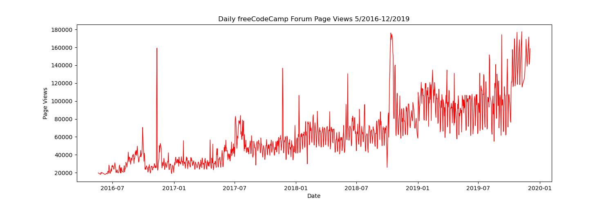
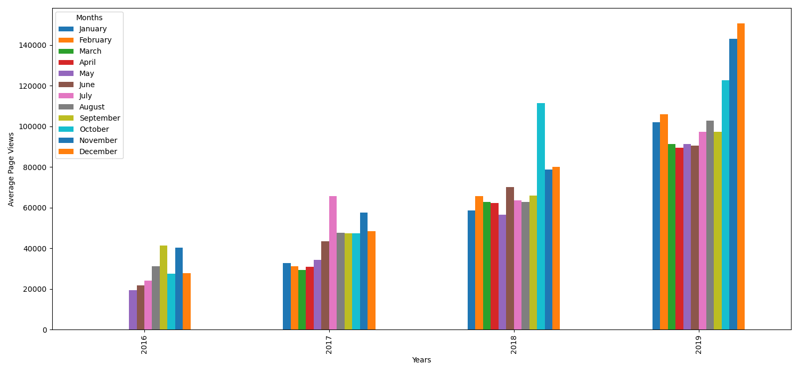
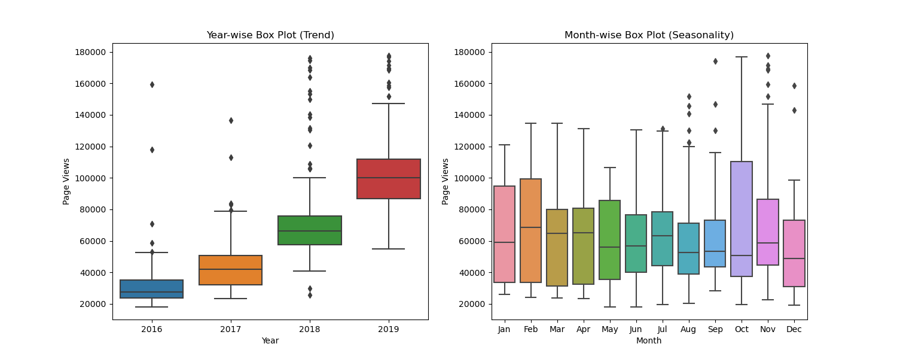

# Page View Time Series Visualizer

This project is part of the **Data Analysis with Python** certification from [freeCodeCamp](https://www.freecodecamp.org/).

It visualizes time series data of page views on the freeCodeCamp Forum using:
- Line plot
- Bar plot
- Box plots

## 📊 Dataset
The dataset used is [`fcc-forum-pageviews.csv`](https://github.com/freeCodeCamp/boilerplate-page-view-time-series-visualizer/blob/master/fcc-forum-pageviews.csv) — it contains daily page view counts from May 2016 to December 2019.

## 📁 Project Structure

- `time_series_visualizer.py` — contains the main code
- `main.ipynb` — used for testing and displaying plots
- `line_plot.png`, `bar_plot.png`, `box_plot.png` — generated visualizations
- `test_module.py` — test script for validation
- `fcc-forum-pageviews.csv` — the data

## 📷 Visualizations

| Line Plot | Bar Plot | Box Plots |
|-----------|----------|-----------|
|  |  |  |

## ✅ How to Run

1. Clone the repo:
   ```bash
   git clone https://github.com/yourusername/page-view-time-series-visualizer
